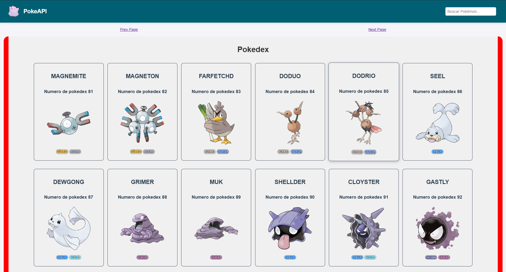
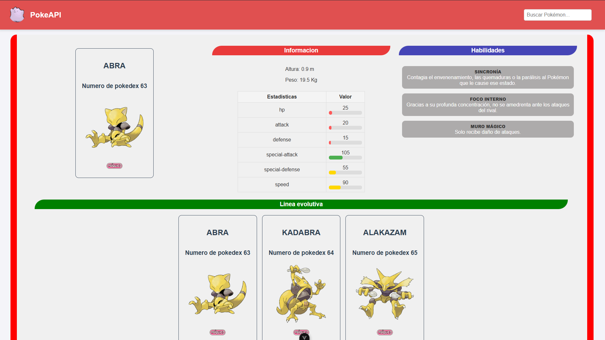

# Pokedex

Poke-API es una pequeña aplicación web desarrollada con Vue.js como parte de un proyecto inicial para aprender este framework. La aplicación muestra una lista de Pokémon con información básica de cada uno.

Puedes probar la aplicación en el siguiente enlace:[Prueba de la página web](https://sam324sam.github.io/Pokedex/)
Este proyecto utiliza almacenamiento local (localStorage) para guardar información en el navegador, y realiza peticiones a la [API pública de Pokémon](https://pokeapi.co/) para obtener los datos.
## Instalacion de dependencias
Requisito previo tener instalado Node.js y Vite 
```sh
npm install
npm install axios
```

## Probar el proyecto

```sh
npm rum dev
```

## Vista del proyecto

<div align="center">
  
</div>

<div align="center">
  
</div>

# Tecnologías utilizadas
- Vue 3

- Axios

- Vite (opcional, según configuración)

- PokeAPI